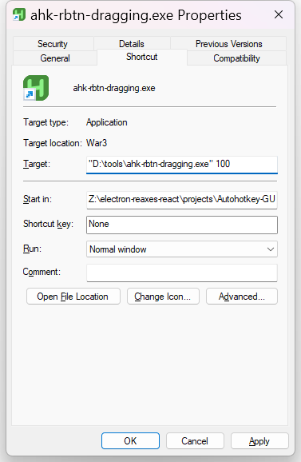
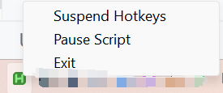

[中文](README.zh.md)
# ahk-rbtn-dragging
#### Right Mouse Button Will Drag the Screen in the Game

This is a tiny app for gamers that allows you to use the right mouse button instead of the middle mouse button for dragging.

**If it doesn't work, try running it as an administrator.**

Note: There is a delay detected between pressing the right mouse button and releasing it. This delay determines whether you are dragging or clicking.This detection delay is set to 90ms by default. 
You can modify this value by creating a shortcut to the executable program and adding a custom value that suits your needs, for example:
`"D:\tools\ahk-rbtn-dragging.exe" 100.`

Supported Game For Now:
<ul>
    <li>Dungeons 4</li>
    <li>StarCraft II</li>
    <li>Age of Darkness: Final Stand</li>
</ul>

to exit:

