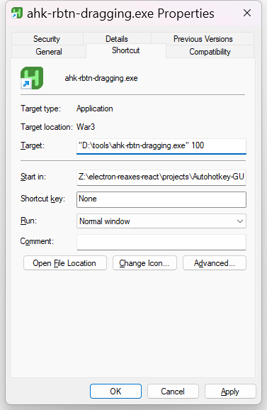

[English](README.md)
# ahk-rbtn-dragging
#### 右鍵將用於在遊戲中拖動畫面

這是一個為玩家設計的小應用，允許你使用右鍵代替中鍵進行拖動操作。

**注意**：當按下右鍵並鬆開時，會檢測到一個延遲。該延遲決定你是在進行拖動操作還是點擊操作。預設的檢測延遲為 90ms。  
你可以通過創建該可執行程序的快捷方式並添加自定義值來修改此延遲，例如：  
`"D:\tools\ahk-rbtn-dragging.exe" 100.`

**目前支持的遊戲**：
<ul>
    <li>《地下城4》（Dungeons 4）</li>
    <li>《星際爭霸 II》（StarCraft II）</li>
    <li>《黑暗時代：最後的堡壘》（Age of Darkness: Final Stand）</li>
</ul>

**退出應用**：  

